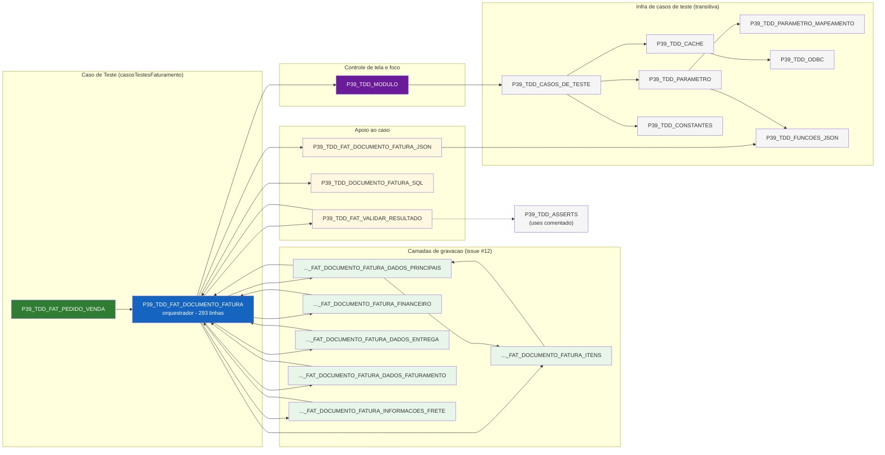

# Mapeamento de Uses - P39_TDD_FAT_PEDIDO_VENDA (fluxo Documento de Fatura / Pedido de Venda)

Mapeamento da AST de `uses` do caso de teste **PEDIDO DE VENDA** (módulo
FATURAMENTO) após a refatoração da unit `P39_TDD_FAT_DOCUMENTO_FATURA`
(issue #12), que passou de 774 para 293 linhas.

Referência de código sincronizada a partir da TekStore em 2026-10-05
(46 units `TDD`).

## Diagrama — AST de Uses



## Dependências diretas

| Unit | `uses` | Papel |
| ---- | ------ | ----- |
| `P39_TDD_FAT_PEDIDO_VENDA` | `..._FAT_DOCUMENTO_FATURA` | Unit do caso. Só define `main`, `Setup` (form/DM/área) e `Teste`. |
| `P39_TDD_FAT_DOCUMENTO_FATURA` | `P39_TDD_MODULO`, `..._DOCUMENTO_FATURA_SQL`, `..._FAT_DOCUMENTO_FATURA_JSON`, `..._FAT_VALIDAR_RESULTADO` + 6 camadas | Núcleo orquestrador. |
| `P39_TDD_MODULO` | `P39_TDD_CASOS_DE_TESTE` | `SetModulo`, `AbrirTela`, `FocarModulo`, `TrazerParaFrente`. |
| `..._FAT_DOCUMENTO_FATURA_JSON` | `P39_TDD_FUNCOES_JSON` | `record TEstrutura` + wrappers `Valor*TagDoc` / `Valor*TagItemConfig`. |
| `..._FAT_DOCUMENTO_FATURA_DADOS_PRINCIPAIS` | `..._FAT_DOCUMENTO_FATURA`, `..._FAT_DOCUMENTO_FATURA_ITENS` | Tabela de preço, condição, prazos e descontos. |
| `..._FAT_DOCUMENTO_FATURA_ITENS` | `..._FAT_DOCUMENTO_FATURA_DADOS_PRINCIPAIS` | Inclusão de itens (específicos ou por tag). |
| `..._FAT_DOCUMENTO_FATURA_FINANCEIRO` | `..._FAT_DOCUMENTO_FATURA` | Financeira / banco. |
| `..._FAT_DOCUMENTO_FATURA_DADOS_ENTREGA` | `..._FAT_DOCUMENTO_FATURA` | Datas de entrega/venda, campanha, parceria. |
| `..._FAT_DOCUMENTO_FATURA_DADOS_FATURAMENTO` | `..._FAT_DOCUMENTO_FATURA` | Transação de venda. |
| `..._FAT_DOCUMENTO_FATURA_INFORMACOES_FRETE` | `..._FAT_DOCUMENTO_FATURA` | Frete manual/embutido e ajuste fiscal. |
| `P39_TDD_FAT_VALIDAR_RESULTADO` | `..._FAT_DOCUMENTO_FATURA`, `P39_TDD_ASSERTS` | Comparação com o resultado esperado. |

## Heranças transitivas

- `P39_TDD_MODULO` → `P39_TDD_CASOS_DE_TESTE` → `P39_TDD_CONSTANTES`,
  `P39_TDD_PARAMETRO`, `P39_TDD_CACHE`
- `P39_TDD_PARAMETRO` → `P39_TDD_PARAMETRO_MAPEAMENTO`, `P39_TDD_FUNCOES_JSON`
- `P39_TDD_CACHE` → `P39_TDD_ODBC`

Por isso o núcleo **não** declara `P39_TDD_CASOS_DE_TESTE` no `uses`: `SetModulo`,
`SetArea`, `CarregarCasosTeste`, `CDSCasosTestes` e `GetConfiguracao` chegam
transitivamente via `P39_TDD_MODULO`.

## Dependências circulares

O grafo tem ciclos, e isso é intencional — as camadas precisam dos `var`
(`CDSCad`, `CDSPedido`, `FCDSClientes`, `FJSON`, ...) e das funções auxiliares
(`ValorInteiroTagDoc`, `_BuscaDadosClientes`) declaradas no núcleo:

```
..._FAT_DOCUMENTO_FATURA  →  ..._DADOS_PRINCIPAIS  →  ..._FAT_DOCUMENTO_FATURA
..._FAT_DOCUMENTO_FATURA  →  ..._ITENS             →  ..._DADOS_PRINCIPAIS
..._FAT_DOCUMENTO_FATURA  →  ..._FAT_VALIDAR_RESULTADO → ..._FAT_DOCUMENTO_FATURA
```

O `JvInterpreter` resolve `uses` por nome de unit e não impõe ordem topológica,
 então o ciclo é aceito. As chamadas entre camadas são **qualificadas** para
 Remover ambiguidade no interpretador (que não aceita `overload`):

```pascal
P39_TDD_FAT_DOCUMENTO_FATURA_DADOS_PRINCIPAIS._DadosPrincipais;
P39_TDD_FAT_DOCUMENTO_FATURA_FINANCEIRO._Financeiro;
P39_TDD_FAT_DOCUMENTO_FATURA_DADOS_ENTREGA._DadosParaEntrega;
P39_TDD_FAT_DOCUMENTO_FATURA_DADOS_FATURAMENTO._DadosFaturamento;
P39_TDD_FAT_DOCUMENTO_FATURA_INFORMACOES_FRETE._InformacoesFrete;
```

## Fluxo executado

```
P39_TDD_FAT_PEDIDO_VENDA.main
 ├─ Setup
 │   ├─ FCadastro := 'FCadPedidoVenda' | FDM := 'DMCadPedidoVenda'
 │   ├─ SetArea('PEDIDO DE VENDA')
 │   └─ Setup_Inicializar
 │       ├─ Setup_InicializarObjetos → P39_TDD_MODULO.SetModulo('FATURAMENTO')
 │       └─ Setup_IniciarFormulario  → P39_TDD_MODULO.AbrirTela('Emisso1Click')
 └─ Teste
     └─ Teste_Executar (loop CDSCasosTestes)
         ├─ SetCasoTeste
         │   ├─ LimparRegistrosCasoTeste + GetObjectJson (documento / item / itens)
         │   ├─ ParseJSONValue(parametros) → _AjustarParametros
         │   │   ├─ FinalizarFormulario  (FormCadastro.Free + FocarModulo + TrazerParaFrente)
         │   │   ├─ P39_TDD_PARAMETRO.VerificarParametros → Relogar
         │   │   └─ Setup_IniciarFormulario (finally)  → reabre a tela
         │   ├─ SetJSON_Caso_Teste
         │   └─ ValidarCasoTeste
         ├─ _IncluiDocumento (loop FCDSClientes)
         │   ├─ BotaoIncluirClick
         │   ├─ DADOS_PRINCIPAIS → ITENS → FINANCEIRO
         │   ├─ DADOS_ENTREGA → DADOS_FATURAMENTO → INFORMACOES_FRETE
         │   └─ BotaoGravar.Click
         └─ CDSCasosTestes.EXECUTADO := 'S'
```

## Asserts — integração e pendências

`P39_TDD_ASSERTS` (modelo DUnitX adaptado ao interpretador) está pronto e é
usado por `P39_TDD_FAT_VALIDAR_RESULTADO`. A integração no fluxo do
PEDIDO DE VENDA está **commentada** e é a próxima frente:

| Ponto | Arquivo | Situação |
| ----- | ------- | -------- |
| `RegistrarDataSet(<DataSet> \|<DM>)` — 10 calls | `P39_TDD_FAT_DOCUMENTO_FATURA.pas` (`Setup_IniciarFormulario`) | comentado |
| `CompararResultadoEsperado` | `P39_TDD_FAT_DOCUMENTO_FATURA.pas` (`Teste_Executar`) | comentado |
| `{TDD_ASSERTS.} //ASSERTS;` | `P39_TDD_RUNNER.pas` | comentado |
| `AssertsFalhou` em erro de inclusão de item | `..._FAT_DOCUMENTO_FATURA_ITENS.pas` | **ativo** |
| `uses P39_TDD_CASOS_DE_TESTE` | `P39_TDD_ASSERTS.pas` linha 1 | comentado |

`RegistrarDataSet` alimenta `FDataSets` em `P39_TDD_ASSERTS`, consumido por
`ValidarResultadoEsperado` para comparar apenas os DataSets declarados no caso de
teste. Sem esses dois pontos habilitados, `CDSCasosTestes.COMPARADO` continua
sempre `'N'` e `METRICAS_ASSERTS` não é alimentada pelo Faturamento.

## Notas

- `P39_TDD_MODULO` resolveu a **perda de foco do módulo**: `AbrirTela` dispara o
  click real do menu (`Emisso1Click`) no `FPrincipal` em vez de criar o form
  avulso, e `FocarModulo` / `TrazerParaFrente` devolvem o foco após o `Relogar`.
- O `Relogar` (`ConectaServidorAplicacao` + `CarregaSecaoAtual`) é **mantido**:
  cada caso de teste pode ter uma situação de parâmetro a ser executada.
- O `FormCadastro` é destruído com `Free` (não apenas `Close`) em
  `FinalizarFormulario`, evitando acúmulo de instância a cada caso.
- DataSets mapeados do `DMCadPedidoVenda`: `CDSCadastro`, `CDSItem`, `CDSFiscal`,
  `CDSPedido`, `CDSCondicaoTabela`, `CDSCondicaoDetalhe`, `CDSTabela`,
  `CDSPrazos`, `CDSDescontoPrincipal`, `CDSItemDesconto`.
- Após atualização externa da unit, fechar/reabrir no BI antes de executar — o
  cache da sessão do ERP pode regravar a versão antiga por cima da nova.