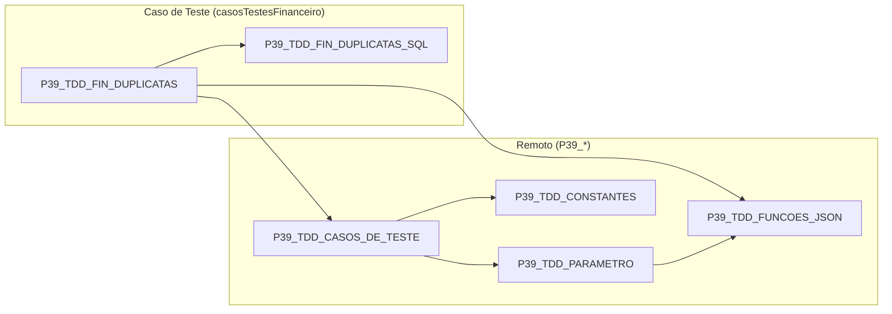

# Mapeamento de Uses - P39_TDD_FIN_DUPLICATAS

Diagrama de dependências (`uses`) do caso de teste **Incluir Duplicatas a
Receber/Pagar** (padrão motor), incluindo a herança transitiva entre as units.

## Diagrama

## Dependências diretas

| Unit | Purpose |
| ---- | ------- |
| `P39_TDD_CASOS_DE_TESTE` | Inicializa os casos de teste, módulo/área, configurações e dados dos casos de teste do banco dedicado. |
| `P39_TDD_FIN_DUPLICATAS_SQL` | Consultas de apoio: pessoa, grupo de resultado e duplicatas em aberto. |
| `P39_TDD_FUNCOES_JSON` | Leitura de tags do JSON do caso de teste (`ValorInteiroTag`, `ValorCurrencyTag`). |

## Heranças transitivas de uses

- `P39_TDD_CASOS_DE_TESTE` → `P39_TDD_CONSTANTES` e `P39_TDD_PARAMETRO`
  - `P39_TDD_PARAMETRO` → `P39_TDD_FUNCOES_JSON`
  - Por isso **não** é necessário declarar `P39_TDD_CONSTANTES` nem `P39_TDD_PARAMETRO`
    no `uses` do motor; eles ficam disponíveis transitivamente.

## Notas

### Absorção de CONTAS_RECEBER / CONTAS_PAGAR

- O motor `P39_TDD_FIN_DUPLICATAS` absorveu a lógica das units legadas
  `P39_TDD_FIN_CONTAS_RECEBER` e `P39_TDD_FIN_CONTAS_PAGAR` (ambas mantidas no
  repositório como referência, mas não mais utilizadas).
- As rotinas públicas são:
  - `IncluirDuplicataReceber` → form `FCadReceber`, pessoa `CLIENTE_FINCONFIG`,
    GR `GR_CONTAS_RECEBER_FINCONFIG`, valor `VALOR_PADRAO_RECEBER_FINCONFIG`.
  - `IncluirDuplicataPagar` → form `FCadPagar`, pessoa `FORNECEDOR_FINCONFIG`,
    GR `GR_CONTAS_PAGAR_FINCONFIG`, valor `VALOR_PADRAO_PAGAR_FINCONFIG`.
- O `InclusaoDeDuplicatas` (processamento) agora referencia o motor em vez das
  units legadas.

### Fluxo executado (padrão motor)

- `IncluirDuplicataReceber`/`IncluirDuplicataPagar` → `ExecutarCasoTeste`
  (`Setup` → `Teste` → `TearDown_DestruirObjetos`).
- `Setup_InicializarObjetos` inicializa os casos de teste via
  `P39_TDD_CASOS_DE_TESTE` (`Setup_Inicializar_CasosTeste`, `SetModulo`,
  `SetArea`, `CarregarConfiguracoes`, `CarregarCasosTeste`, `GetConfiguracao`).
- `Teste_Executar` percorre `CDSCasosTestes` filtrando pela descrição do caso de
  teste (`CADASTRAR DUPLICATA A RECEBER`/`A PAGAR`) e marca `EXECUTADO = 'S'`.

### Tags lidas do JSON do caso de teste

| Tag | Fallback |
| --- | -------- |
| `PESSOA_DUP` | `CLIENTE_FINCONFIG` ou `FORNECEDOR_FINCONFIG` |
| `VALOR_DUP` | `VALOR_PADRAO_RECEBER_FINCONFIG` ou `VALOR_PADRAO_PAGAR_FINCONFIG` |
| `GRUPORESULTADO_DUPGR` | `GR_CONTAS_RECEBER_FINCONFIG` ou `GR_CONTAS_PAGAR_FINCONFIG` |
| `TIPODOC_DUP` | `TIPO_FINCONFIG` |
| `QUALIFICACAO_DUP` | `0` (só preenche se > 0) |
