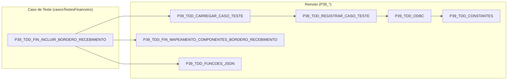

# Mapeamento de Uses - P39_TDD_FIN_INCLUIR_BORDERO_RECEBIMENTO

Diagrama de dependências (`uses`) do caso de teste **Incluir Borderô de
Recebimento**, incluindo a herança transitiva entre as units.

## Diagrama

## Dependências diretas

| Unit | Purpose |
| ---- | ------- |
| `P39_TDD_CARREGAR_CASO_TESTE` | Carrega o caso de teste do banco e popula o CDS por referência. |
| `P39_TDD_FIN_MAPEAMENTO_COMPONENTES_BORDERO_RECEBIMENTO` | Mapeia o form `FCadBorderoAcerto` e os CDSs do borderô. |
| `P39_TDD_FUNCOES_JSON` | Leitura de tags do JSON do caso de teste (`ValorInteiroTag`, etc.). |

## Heranças transitivas de uses

- `P39_TDD_CARREGAR_CASO_TESTE` → `P39_TDD_REGISTRAR_CASO_TESTE` → `P39_TDD_ODBC` → `P39_TDD_CONSTANTES`
  - Por isso **não** é necessário declarar `P39_TDD_ODBC` no `uses` da unit principal.
  - `TDDReaderODBC` e `MensagemPersonalizada` ficam disponíveis transitivamente.

## Notas

### Padrão motor (Setup/Teste/TearDown)

- A unit foi promovida ao padrão motor (antes localizada em `emDesenvolvimento`).
- `IncluirBorderoRecebimento` executa o fluxo completo: `Setup`, `Teste` e
  `TearDown_DestruirObjetos`.
- No `uses` são usadas as variantes remotas `P39_TDD_*` (a unit de desenvolvimento
  local `TDD_*` foi descontinuada após a promoção).

### Leitura da configuração financeira

- A unit não depende de `P39_TDD_FIN_CONFIG_FINANCEIRO`. O SQL
  `GetSQLSelectFinanceiroConfig` é função local, lendo `FINANCEIRO_CONFIGURACAO` via
  `TDDReaderODBC` (herdado transitivamente) e os campos
  `CLIENTE_FINCONFIG`/`CONTA_PRINCIPAL_FINCONFIG`.

### Form real do borderô

O mapeamento `P39_TDD_FIN_MAPEAMENTO_COMPONENTES_BORDERO_RECEBIMENTO` aponta para o
form **`FCadBorderoAcerto`** / **`DMCadBorderoAcerto`** (Bordero de Acerto).

### Regra de negócio: valor do complemento

- `_IncluiBorderoRecebimento` calcula `VALOR_COMPLBORD` somando `VLREMABERTO` das
  duplicatas a receber em aberto da pessoa (`PESSOA_DUP` do JSON, com fallback
  `CLIENTE_FINCONFIG`).
- Se não houver duplicata em aberto (ou valor zero), o ERP rejeita o gravamento com
  **"O valor do complemento deve ser maior que zero"**.
- O JSON do caso de teste deve apontar (`PESSOA_DUP`) para uma pessoa que possua
  duplicatas a receber em aberto no ERP — normalmente as duplicatas criadas pelo caso
  de teste **CADASTRAR DUPLICATA A RECEBER** executado antes na suíte.
- A unit valida `VlrPagar = 0` e aborta com mensagem acionável antes de chegar à
  regra de negócio do ERP.
