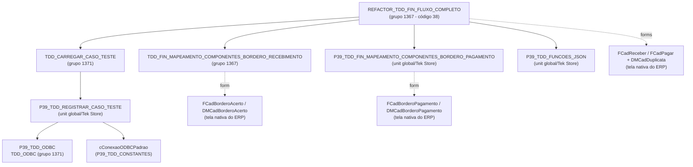
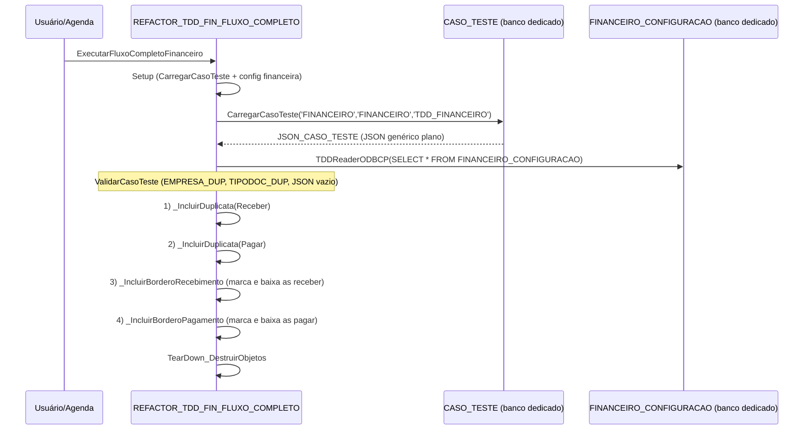

# REFACTOR_TDD_FIN_FLUXO_COMPLETO

Unit orquestradora do caso de teste único **TDD_FINANCEIRO** (módulo FINANCEIRO / área FINANCEIRO),
cobrindo o fluxo completo dos 4 recursos:

1. Cadastro de Duplicata a Receber (`FCadReceber`)
2. Cadastro de Duplicata a Pagar (`FCadPagar`)
3. Borderô de Recebimento (`FCadBorderoAcerto`) — baixa as duplicatas a receber
4. Borderô de Pagamento (`FCadBorderoPagamento`) — baixa as duplicatas a pagar

## Mapeamento de uses

## Fluxo de execução

## Contrato do JSON genérico (`TDD_JSON_BASE_FINANCEIRO`, grupo 1369, código 27)

JSON **plano** (sem objetos aninhados por recurso). Tags compartilhadas entre os recursos;
quando o valor é `0`, cada recurso aplica o fallback da `FINANCEIRO_CONFIGURACAO`:

| Tag | Fallback (quando 0) |
| --- | --- |
| `PESSOA_DUP` | Receber → `CLIENTE_FINCONFIG`; Pagar → `FORNECEDOR_FINCONFIG` |
| `VALOR_DUP` | Receber → `VALOR_PADRAO_RECEBER_FINCONFIG`; Pagar → `VALOR_PADRAO_PAGAR_FINCONFIG` |
| `GRUPORESULTADO_DUPGR` | Receber → `GR_CONTAS_RECEBER_FINCONFIG`; Pagar → `GR_CONTAS_PAGAR_FINCONFIG` |
| `CONTA_BORD` | Ambos os borderôs → `CONTA_PRINCIPAL_FINCONFIG` |
| `TIPODOC_DUP` | Obrigatória (validada); fallback → `TIPO_FINCONFIG` na inclusão |
| `QUALIFICACAO_DUP` | Opcional; aplicada somente se > 0 |

A seção `parametros` mantém as flags de configuração financeira (`*_CFS`) para futuras validações.

## Observações

- **O JSON do caso de teste deve ser gravado em formato compacto** (sem espaços após
  `:` e `,`), ex.: `{"EMPRESA_DUP":1,...}`. O parser de tags de `P39_TDD_FUNCOES_JSON`
  não tolera *pretty-print*; com espaçamento, `ValorInteiroTag` retorna o default (`0`)
  e a validação acusa "Tag ausente ou zerada" (erro observado na primeira execução).
- A unit orquestradora foi renomeada pelo usuário para **`REFACTOR_TDD_FINANCEIRO`**
  (código 38, grupo 1367).
- Os casos antigos da área BORDERÔ (AUTOINC 8, 26 e 27) foram **inativados** no banco dedicado;
  o caso unificado é o AUTOINC **28 – TDD_FINANCEIRO**.
- O fluxo do borderô de pagamento depende da unit global
  `P39_TDD_FIN_MAPEAMENTO_COMPONENTES_BORDERO_PAGAMENTO` (Tek Store), que expõe
  `CriarObjetos`, `IniciarCDSCadastroBordero`, `fBorderoPagamento`, `CDSPagar`,
  `CDSComplemento`, `SPessoa`, `rgPessoa`, `PageControl` e as abas (`cAbaContasPagar`,
  `cAbaComplementos`).
- Pontos que exigem validação em execução real no ERP: seleção do fornecedor via
  `SPessoa.Value` + `rgPessoa.ItemIndex := 1` e nomes dos campos `VLREMABERTO`/`MARQUE`
  do `CDSPagar`.
