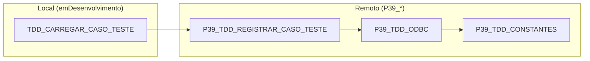

# Mapeamento de Uses - TDD_CARREGAR_CASO_TESTE

Diagrama de dependências (`uses`) do carregador local de casos de teste, incluindo a
herança transitiva entre as units.

## Diagrama

## Dependências diretas

| Unit | Purpose |
| ---- | ------- |
| `P39_TDD_REGISTRAR_CASO_TESTE` | Resolve módulo/área do caso de teste (`RegistroFallbackModulo`/`RegistroFallbackArea`). |

## Heranças transitivas de uses

- `P39_TDD_REGISTRAR_CASO_TESTE` → `P39_TDD_ODBC` → `P39_TDD_CONSTANTES`
  - `TDDReaderODBC` e `MensagemPersonalizada` ficam disponíveis transitivamente,
    sem necessidade de declarar `P39_TDD_ODBC`/`P39_TDD_CONSTANTES` no `uses`.

## Notas

### Variante remota no `uses`

- A unit usa **`P39_TDD_REGISTRAR_CASO_TESTE`** (variante remota/global do ERP). A
  variante local `TDD_REGISTRAR_CASO_TESTE` (sem prefixo) não existe como unit global e
  causaria erro de resolução de `uses` no interpretador.
- Quem usa `TDD_CARREGAR_CASO_TESTE` enxerga `TDDReaderODBC` e `MensagemPersonalizada`
  de forma transitiva (herança de `uses`).
