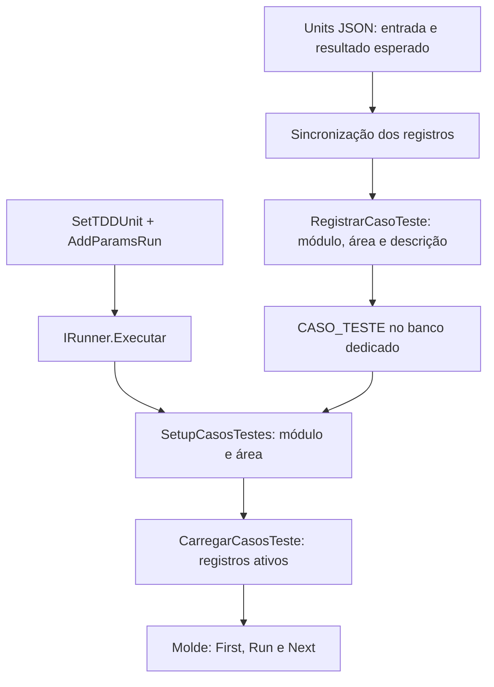

# Preparar dados e iniciar o lote

Documentação: Casos de teste. Este arquivo é a fonte do diagrama exibido pelo portal.

```mermaid
flowchart TD
  JSON["Units JSON: entrada e resultado esperado"] --> Sincronizar["Sincronização dos registros"]
  Sincronizar --> Cadastro["RegistrarCasoTeste: módulo, área e descrição"]
  Cadastro --> Banco["CASO_TESTE no banco dedicado"]
  Configurar["SetTDDUnit + AddParamsRun"] --> IRunner["IRunner.Executar"]
  IRunner --> Setup["SetupCasosTestes: módulo e área"]
  Banco --> Setup
  Setup --> Dados["CarregarCasosTeste: registros ativos"]
  Dados --> Lote["Molde: First, Run e Next"]
```
