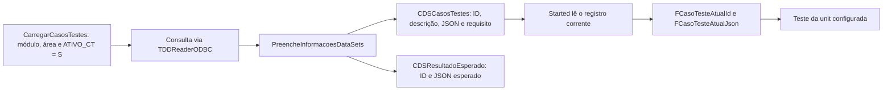

# Da seleção ao estado compartilhado

Documentação: Casos de teste. Este arquivo é a fonte do diagrama exibido pelo portal.

```mermaid
flowchart LR
  Selecionar["CarregarCasosTestes: módulo, área e ATIVO_CT = S"] --> Temporario["Consulta via TDDReaderODBC"]
  Temporario --> Preencher["PreencheInformacoesDataSets"]
  Preencher --> Casos["CDSCasosTestes: ID, descrição, JSON e requisito"]
  Preencher --> Esperado["CDSResultadoEsperado: ID e JSON esperado"]
  Casos --> Started["Started lê o registro corrente"]
  Started --> Contexto["FCasoTesteAtualId e FCasoTesteAtualJson"]
  Contexto --> Teste["Teste da unit configurada"]
```
