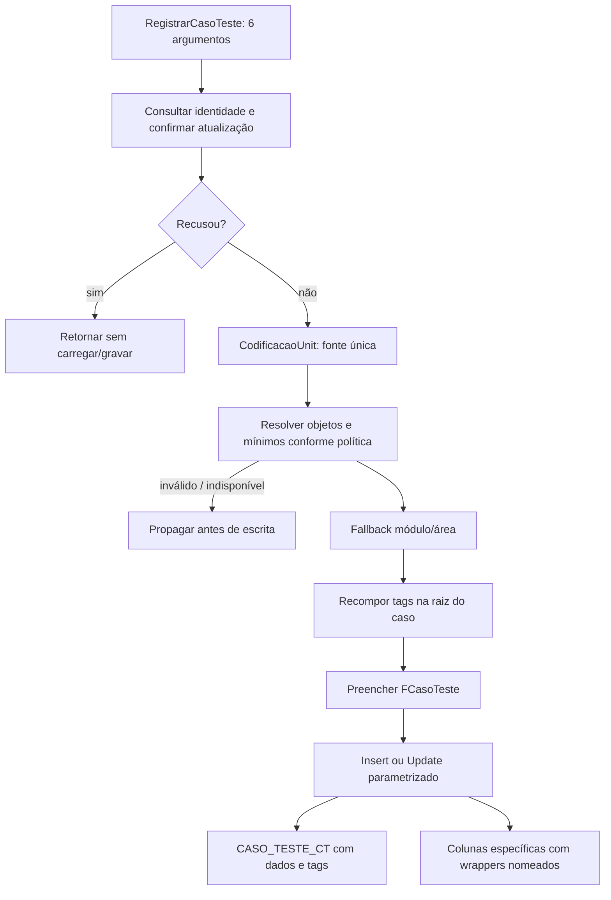

# Fonte única e projeções atuais

```mermaid
flowchart TD
 I["RegistrarCasoTeste: 6 argumentos"] --> C["Consultar identidade e confirmar atualização"]
 C --> Q{"Recusou?"}
 Q -- "sim" --> R["Retornar sem carregar/gravar"]
 Q -- "não" --> U["CodificacaoUnit: fonte única"]
 U --> D["Resolver objetos e mínimos conforme política"]
 D -- "inválido / indisponível" --> E["Propagar antes de escrita"]
 D --> M["Fallback módulo/área"]
 M --> P["Recompor tags na raiz do caso"]
 P --> F["Preencher FCasoTeste"]
 F --> S["Insert ou Update parametrizado"]
 S --> J["CASO_TESTE_CT com dados e tags"]
 S --> K["Colunas específicas com wrappers nomeados"]
```
