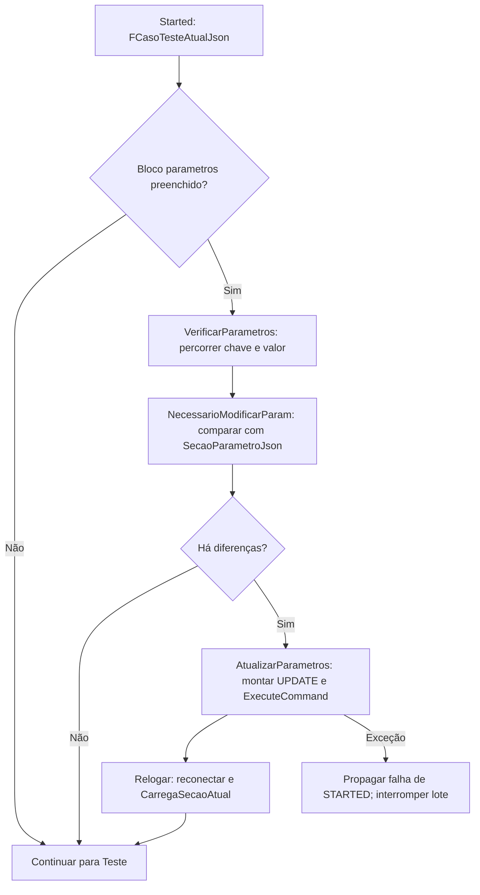

# Do JSON até a configuração usada por Teste

Documentação: Parâmetros do ERP. Este arquivo é a fonte do diagrama exibido pelo portal.

```mermaid
flowchart TD
  Caso["Started: FCasoTesteAtualJson"] --> Bloco{"Bloco parametros preenchido?"}
  Bloco -- Não --> Teste["Continuar para Teste"]
  Bloco -- Sim --> Verificar["VerificarParametros: percorrer chave e valor"]
  Verificar --> Comparar["NecessarioModificarParam: comparar com SecaoParametroJson"]
  Comparar --> Diferencas{"Há diferenças?"}
  Diferencas -- Não --> Teste
  Diferencas -- Sim --> Atualizar["AtualizarParametros: montar UPDATE e ExecuteCommand"]
  Atualizar --> Relogar["Relogar: reconectar e CarregaSecaoAtual"]
  Relogar --> Teste
  Atualizar -- Exceção --> Falha["Propagar falha de STARTED; interromper lote"]
```
