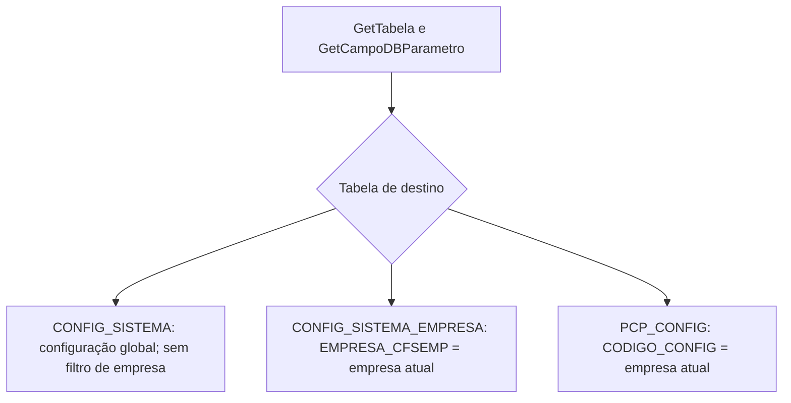

# Escopo do UPDATE por tabela

Documentação: Parâmetros do ERP. Este arquivo é a fonte do diagrama exibido pelo portal.

```mermaid
flowchart TD
  Chave["GetTabela e GetCampoDBParametro"] --> Tabela{"Tabela de destino"}
  Tabela --> Global["CONFIG_SISTEMA: configuração global; sem filtro de empresa"]
  Tabela --> Empresa["CONFIG_SISTEMA_EMPRESA: EMPRESA_CFSEMP = empresa atual"]
  Tabela --> PCP["PCP_CONFIG: CODIGO_CONFIG = empresa atual"]
```
