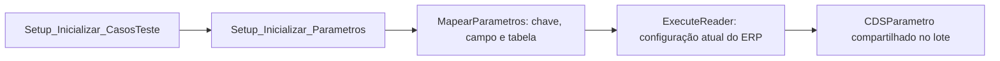

# Inicializar o mapeamento e a leitura da configuração

Documentação: Parâmetros do ERP. Este arquivo é a fonte do diagrama exibido pelo portal.

```mermaid
flowchart LR
  Setup["Setup_Inicializar_CasosTeste"] --> Parametros["Setup_Inicializar_Parametros"]
  Parametros --> Mapa["MapearParametros: chave, campo e tabela"]
  Mapa --> Leitura["ExecuteReader: configuração atual do ERP"]
  Leitura --> CDS["CDSParametro compartilhado no lote"]
```
