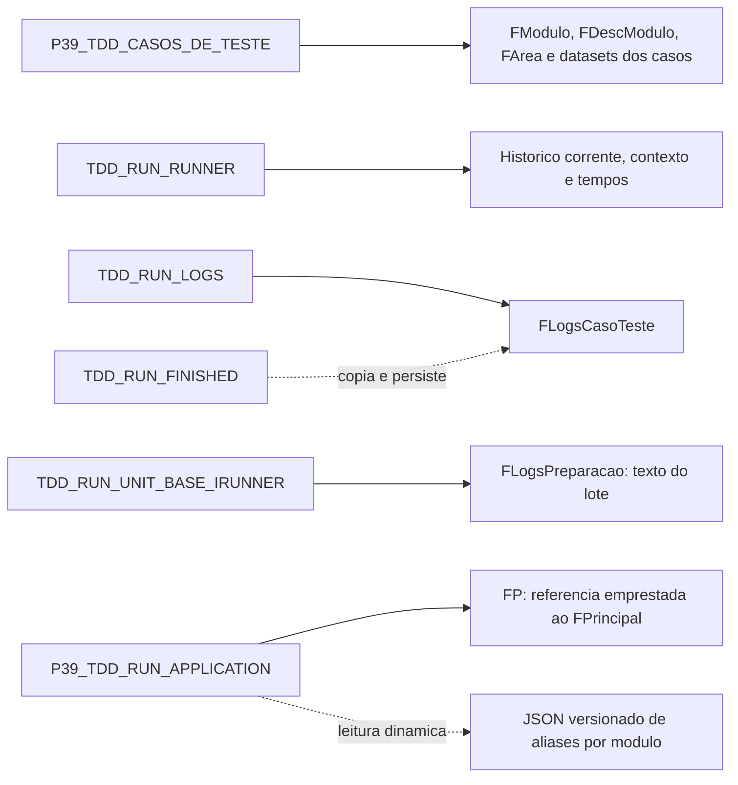

# Donos dos estados

```mermaid
flowchart LR
  Casos[P39_TDD_CASOS_DE_TESTE] --> Contexto[FModulo, FDescModulo, FArea e datasets dos casos]
  Runner[TDD_RUN_RUNNER] --> Metricas[Historico corrente, contexto e tempos]
  Logs[TDD_RUN_LOGS] --> Lista[FLogsCasoTeste]
  Molde[TDD_RUN_UNIT_BASE_IRUNNER] --> Preparacao[FLogsPreparacao: texto do lote]
  Application[P39_TDD_RUN_APPLICATION] --> Principal[FP: referencia emprestada ao FPrincipal]
  Application -. leitura dinamica .-> Catalogo[JSON versionado de aliases por modulo]
  Finished[TDD_RUN_FINISHED] -. copia e persiste .-> Lista
```

TDD_RUN_APPLICATION não mantém outra cópia de FModulo ou FDescModulo e não destrói o formulário principal.
