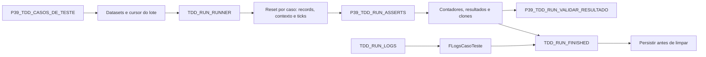

# Ciclo dos estados compartilhados

```mermaid
flowchart LR
 P39_TDD_CASOS_DE_TESTE --> C["Datasets e cursor do lote"]
 C --> TDD_RUN_RUNNER
 TDD_RUN_RUNNER --> R["Reset por caso: records, contexto e ticks"]
 R --> P39_TDD_RUN_ASSERTS
 P39_TDD_RUN_ASSERTS --> A["Contadores, resultados e clones"]
 A --> P39_TDD_RUN_VALIDAR_RESULTADO
 A --> TDD_RUN_FINISHED
 TDD_RUN_LOGS --> L["FLogsCasoTeste"]
 L --> TDD_RUN_FINISHED
 TDD_RUN_FINISHED --> P["Persistir antes de limpar"]
```
