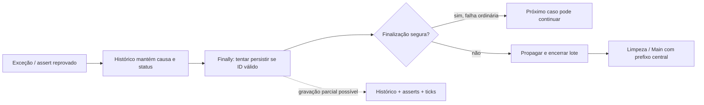

# Falhas e continuidade

```mermaid
flowchart LR
 E["Exceção / assert reprovado"] --> H["Histórico mantém causa e status"]
 H --> F["Finally: tentar persistir se ID válido"]
 F --> Q{"Finalização segura?"}
 Q -- "sim, falha ordinária" --> N["Próximo caso pode continuar"]
 Q -- "não" --> P["Propagar e encerrar lote"]
 F -. "gravação parcial possível" .-> D["Histórico + asserts + ticks"]
 P --> C["Limpeza / Main com prefixo central"]
```
