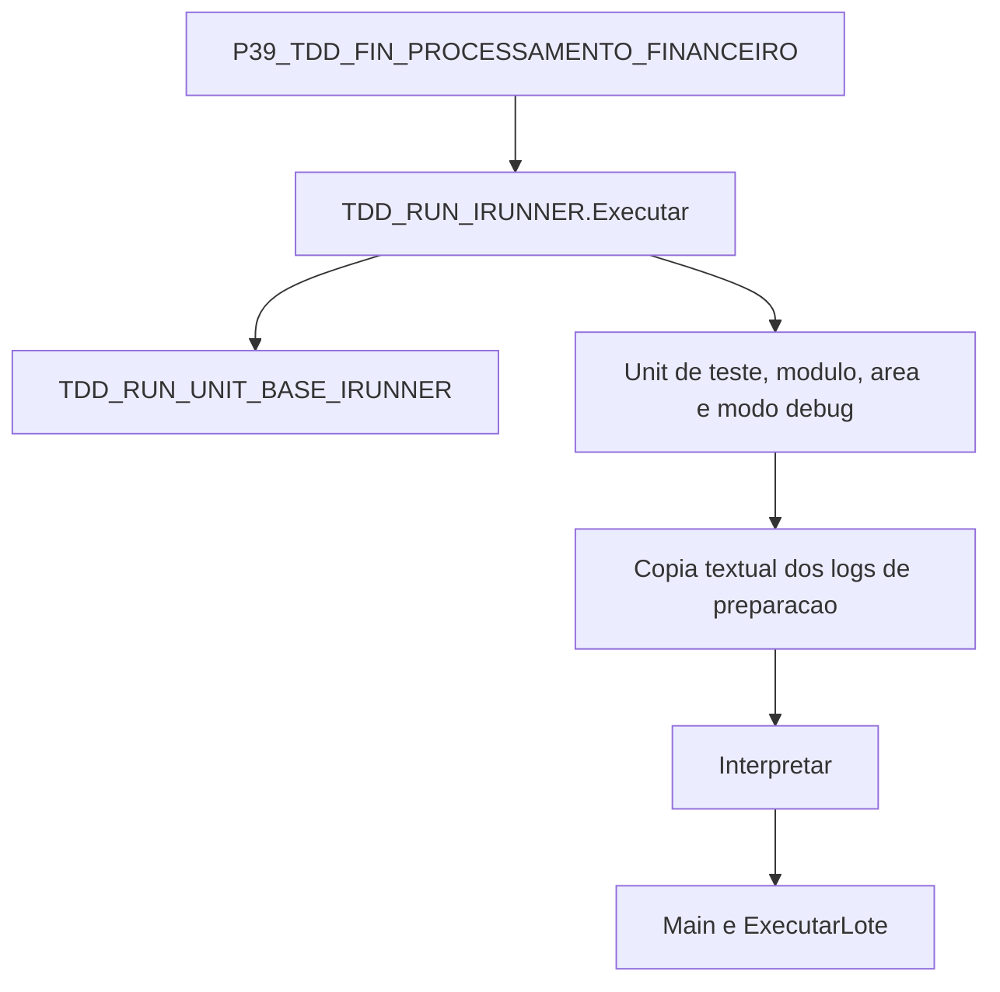

# Montagem do programa interpretado

```mermaid
flowchart TD
  Entrada[P39_TDD_FIN_PROCESSAMENTO_FINANCEIRO] --> Montagem[TDD_RUN_IRUNNER.Executar]
  Montagem --> Molde[TDD_RUN_UNIT_BASE_IRUNNER]
  Montagem --> Substituicoes[Unit de teste, modulo, area e modo debug]
  Substituicoes --> Snapshot[Copia textual dos logs de preparacao]
  Snapshot --> Interpretar[Interpretar]
  Interpretar --> Lote[Main e ExecutarLote]
```

A carga do molde usa CodificacaoUnit. O snapshot transporta texto; não exige uma lista compartilhada entre as interpretações.
