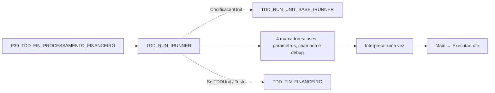

# Geração e interpretação única

```mermaid
flowchart LR
 P39_TDD_FIN_PROCESSAMENTO_FINANCEIRO --> TDD_RUN_IRUNNER
 TDD_RUN_IRUNNER -. "CodificacaoUnit" .-> TDD_RUN_UNIT_BASE_IRUNNER
 TDD_RUN_IRUNNER --> M["4 marcadores: uses, parâmetros, chamada e debug"]
 M --> I["Interpretar uma vez"]
 I --> L["Main → ExecutarLote"]
 TDD_RUN_IRUNNER -. "SetTDDUnit / Teste" .-> TDD_FIN_FINANCEIRO
```

Setas tracejadas representam seleção/carga dinâmica; não são cláusulas uses extraídas do AST.
