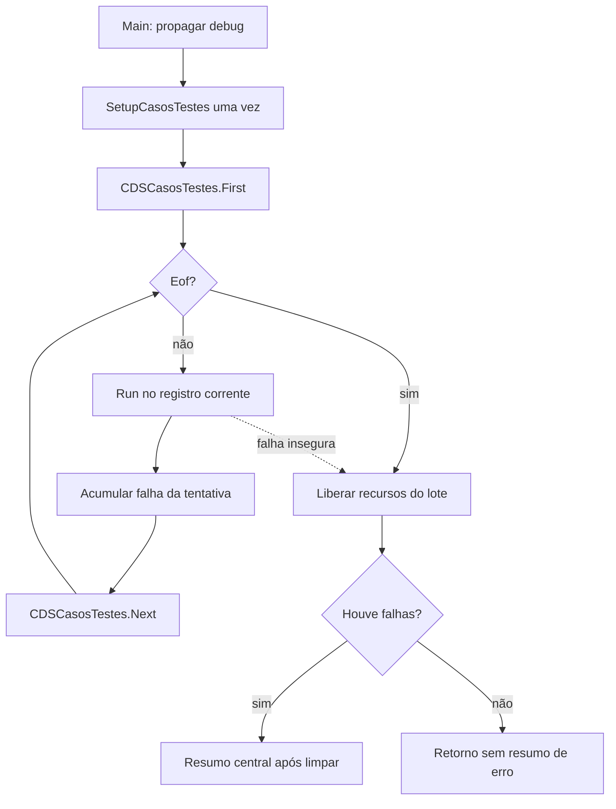

# Fluxo do lote

```mermaid
flowchart TD
 M["Main: propagar debug"] --> S["SetupCasosTestes uma vez"]
 S --> F["CDSCasosTestes.First"]
 F --> E{"Eof?"}
 E -- "não" --> R["Run no registro corrente"]
 R --> A["Acumular falha da tentativa"]
 A --> N["CDSCasosTestes.Next"]
 N --> E
 E -- "sim" --> C["Liberar recursos do lote"]
 C --> Q{"Houve falhas?"}
 Q -- "sim" --> X["Resumo central após limpar"]
 Q -- "não" --> O["Retorno sem resumo de erro"]
 R -. "falha insegura" .-> C
```
