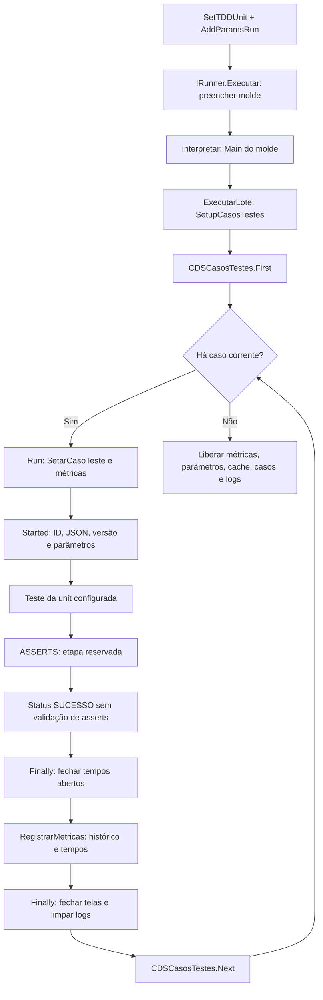

# Da entrada à persistência

Documentação: Estrutura e fluxo de IRunner.Executar. Este arquivo é a fonte do diagrama exibido pelo portal.

```mermaid
flowchart TD
  Entrada["SetTDDUnit + AddParamsRun"] --> Montar["IRunner.Executar: preencher molde"]
  Montar --> Interpretar["Interpretar: Main do molde"]
  Interpretar --> Setup["ExecutarLote: SetupCasosTestes"]
  Setup --> First["CDSCasosTestes.First"]
  First --> Corrente{"Há caso corrente?"}
  Corrente -- Sim --> Run["Run: SetarCasoTeste e métricas"]
  Run --> Started["Started: ID, JSON, versão e parâmetros"]
  Started --> Teste["Teste da unit configurada"]
  Teste --> Asserts["ASSERTS: etapa reservada"]
  Asserts --> Sucesso["Status SUCESSO sem validação de asserts"]
  Sucesso --> Tempos["Finally: fechar tempos abertos"]
  Tempos --> Finished["RegistrarMetricas: histórico e tempos"]
  Finished --> Telas["Finally: fechar telas e limpar logs"]
  Telas --> Next["CDSCasosTestes.Next"]
  Next --> Corrente
  Corrente -- Não --> Limpeza["Liberar métricas, parâmetros, cache, casos e logs"]
```
