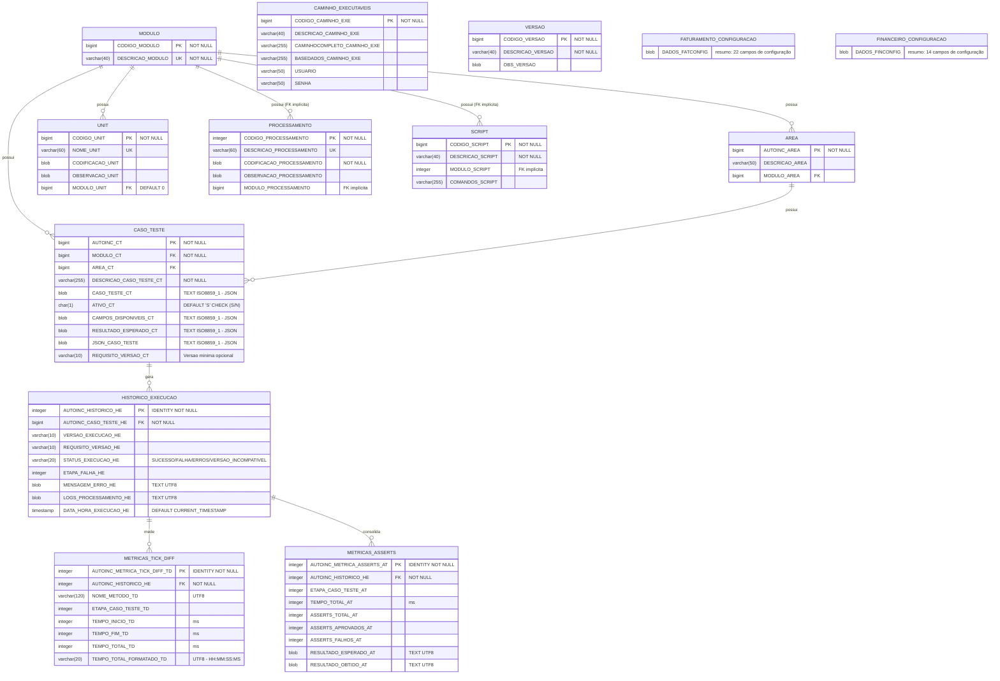

# Modelo de histórico e métricas

```mermaid
erDiagram
    MODULO {
        bigint CODIGO_MODULO PK "NOT NULL"
        varchar(40) DESCRICAO_MODULO UK "NOT NULL"
    }
    AREA {
        bigint AUTOINC_AREA PK "NOT NULL"
        varchar(50) DESCRICAO_AREA
        bigint MODULO_AREA FK
    }
    CASO_TESTE {
        bigint AUTOINC_CT PK "NOT NULL"
        bigint MODULO_CT FK "NOT NULL"
        bigint AREA_CT FK
        varchar(255) DESCRICAO_CASO_TESTE_CT "NOT NULL"
        blob CASO_TESTE_CT "TEXT ISO8859_1 - JSON"
        char(1) ATIVO_CT "DEFAULT 'S' CHECK (S/N)"
        blob CAMPOS_DISPONIVEIS_CT "TEXT ISO8859_1 - JSON"
        blob RESULTADO_ESPERADO_CT "TEXT ISO8859_1 - JSON"
        blob JSON_CASO_TESTE "TEXT ISO8859_1 - JSON"
        varchar(10) REQUISITO_VERSAO_CT "Versao minima opcional"
    }
    HISTORICO_EXECUCAO {
        integer AUTOINC_HISTORICO_HE PK "IDENTITY NOT NULL"
        bigint AUTOINC_CASO_TESTE_HE FK "NOT NULL"
        varchar(10) VERSAO_EXECUCAO_HE
        varchar(10) REQUISITO_VERSAO_HE
        varchar(20) STATUS_EXECUCAO_HE "SUCESSO/FALHA/ERROS/VERSAO_INCOMPATIVEL"
        integer ETAPA_FALHA_HE
        blob MENSAGEM_ERRO_HE "TEXT UTF8"
        blob LOGS_PROCESSAMENTO_HE "TEXT UTF8"
        timestamp DATA_HORA_EXECUCAO_HE "DEFAULT CURRENT_TIMESTAMP"
    }
    METRICAS_TICK_DIFF {
        integer AUTOINC_METRICA_TICK_DIFF_TD PK "IDENTITY NOT NULL"
        integer AUTOINC_HISTORICO_HE FK "NOT NULL"
        varchar(120) NOME_METODO_TD "UTF8"
        integer ETAPA_CASO_TESTE_TD
        integer TEMPO_INICIO_TD "ms"
        integer TEMPO_FIM_TD "ms"
        integer TEMPO_TOTAL_TD "ms"
        varchar(20) TEMPO_TOTAL_FORMATADO_TD "UTF8 - HH:MM:SS:MS"
    }
    METRICAS_ASSERTS {
        integer AUTOINC_METRICA_ASSERTS_AT PK "IDENTITY NOT NULL"
        integer AUTOINC_HISTORICO_HE FK "NOT NULL"
        integer ETAPA_CASO_TESTE_AT
        integer TEMPO_TOTAL_AT "ms"
        integer ASSERTS_TOTAL_AT
        integer ASSERTS_APROVADOS_AT
        integer ASSERTS_FALHOS_AT
        blob RESULTADO_ESPERADO_AT "TEXT UTF8"
        blob RESULTADO_OBTIDO_AT "TEXT UTF8"
    }
    UNIT {
        bigint CODIGO_UNIT PK "NOT NULL"
        varchar(60) NOME_UNIT UK
        blob CODIFICACAO_UNIT
        blob OBSERVACAO_UNIT
        bigint MODULO_UNIT FK "DEFAULT 0"
    }
    PROCESSAMENTO {
        integer CODIGO_PROCESSAMENTO PK "NOT NULL"
        varchar(60) DESCRICAO_PROCESSAMENTO UK
        blob CODIFICACAO_PROCESSAMENTO "NOT NULL"
        blob OBSERVACAO_PROCESSAMENTO
        bigint MODULO_PROCESSAMENTO "FK implícita"
    }
    SCRIPT {
        bigint CODIGO_SCRIPT PK "NOT NULL"
        varchar(40) DESCRICAO_SCRIPT "NOT NULL"
        integer MODULO_SCRIPT "FK implícita"
        varchar(255) COMANDOS_SCRIPT
    }
    CAMINHO_EXECUTAVEIS {
        bigint CODIGO_CAMINHO_EXE PK "NOT NULL"
        varchar(40) DESCRICAO_CAMINHO_EXE
        varchar(255) CAMINHOCOMPLETO_CAMINHO_EXE
        varchar(255) BASEDADOS_CAMINHO_EXE
        varchar(50) USUARIO
        varchar(50) SENHA
    }
    VERSAO {
        bigint CODIGO_VERSAO PK "NOT NULL"
        varchar(40) DESCRICAO_VERSAO "NOT NULL"
        blob OBS_VERSAO
    }
    FATURAMENTO_CONFIGURACAO {
        blob DADOS_FATCONFIG "resumo: 22 campos de configuração"
    }
    FINANCEIRO_CONFIGURACAO {
        blob DADOS_FINCONFIG "resumo: 14 campos de configuração"
    }

    MODULO ||--o{ AREA : "possui"
    MODULO ||--o{ CASO_TESTE : "possui"
    AREA ||--o{ CASO_TESTE : "possui"
    CASO_TESTE ||--o{ HISTORICO_EXECUCAO : "gera"
    HISTORICO_EXECUCAO ||--o{ METRICAS_TICK_DIFF : "mede"
    HISTORICO_EXECUCAO ||--o{ METRICAS_ASSERTS : "consolida"
    MODULO ||--o{ UNIT : "possui"
    MODULO ||--o{ PROCESSAMENTO : "possui (FK implícita)"
    MODULO ||--o{ SCRIPT : "possui (FK implícita)"
```

Contrato documental do código atual. Não certifica migrations aplicadas em todos os ambientes.
