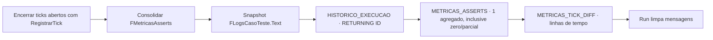

# Persistência por tentativa

```mermaid
flowchart LR
 T["Encerrar ticks abertos com RegistrarTick"] --> A["Consolidar FMetricasAsserts"]
 A --> L["Snapshot FLogsCasoTeste.Text"]
 L --> H["HISTORICO_EXECUCAO · RETURNING ID"]
 H --> M["METRICAS_ASSERTS · 1 agregado, inclusive zero/parcial"]
 M --> K["METRICAS_TICK_DIFF · linhas de tempo"]
 K --> C["Run limpa mensagens"]
```

Sem retry automático nem transação única garantida para pai/filhos. Falhas de encerramento/persistência preservam a causa anterior.
