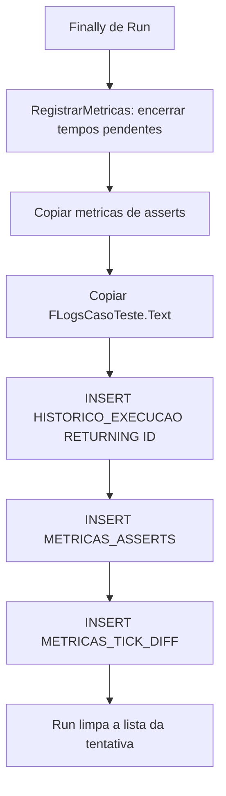

# Persistência da tentativa

```mermaid
flowchart TD
  Finally[Finally de Run] --> Ticks[RegistrarMetricas: encerrar tempos pendentes]
  Ticks --> Asserts[Copiar metricas de asserts]
  Asserts --> Logs[Copiar FLogsCasoTeste.Text]
  Logs --> Historico[INSERT HISTORICO_EXECUCAO RETURNING ID]
  Historico --> Verificacoes[INSERT METRICAS_ASSERTS]
  Verificacoes --> Tempos[INSERT METRICAS_TICK_DIFF]
  Tempos --> Limpar[Run limpa a lista da tentativa]
```

As mensagens são capturadas independentemente de FModoDebug. Não há retry automático que repita o INSERT do histórico após falha das métricas.
