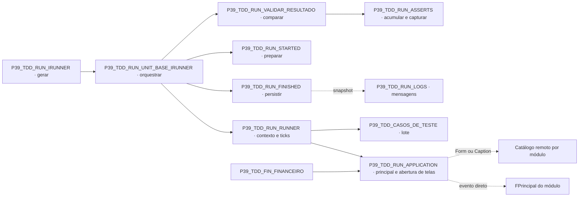

# Responsabilidades do fluxo

```mermaid
flowchart LR
 P39_TDD_RUN_IRUNNER["P39_TDD_RUN_IRUNNER · gerar"] --> P39_TDD_RUN_UNIT_BASE_IRUNNER["P39_TDD_RUN_UNIT_BASE_IRUNNER · orquestrar"]
 P39_TDD_RUN_UNIT_BASE_IRUNNER --> P39_TDD_RUN_RUNNER["P39_TDD_RUN_RUNNER · contexto e ticks"]
 P39_TDD_RUN_UNIT_BASE_IRUNNER --> P39_TDD_RUN_STARTED["P39_TDD_RUN_STARTED · preparar"]
 P39_TDD_RUN_UNIT_BASE_IRUNNER --> P39_TDD_RUN_VALIDAR_RESULTADO["P39_TDD_RUN_VALIDAR_RESULTADO · comparar"]
 P39_TDD_RUN_VALIDAR_RESULTADO --> P39_TDD_RUN_ASSERTS["P39_TDD_RUN_ASSERTS · acumular e capturar"]
 P39_TDD_RUN_UNIT_BASE_IRUNNER --> P39_TDD_RUN_FINISHED["P39_TDD_RUN_FINISHED · persistir"]
 P39_TDD_RUN_FINISHED -. "snapshot" .-> P39_TDD_RUN_LOGS["P39_TDD_RUN_LOGS · mensagens"]
 P39_TDD_RUN_RUNNER --> P39_TDD_CASOS_DE_TESTE["P39_TDD_CASOS_DE_TESTE · lote"]
 P39_TDD_RUN_RUNNER --> P39_TDD_RUN_APPLICATION["P39_TDD_RUN_APPLICATION · principal e abertura de telas"]
 P39_TDD_FIN_FINANCEIRO --> P39_TDD_RUN_APPLICATION
 P39_TDD_RUN_APPLICATION -. "Form ou Caption" .-> C["Catálogo remoto por módulo"]
 P39_TDD_RUN_APPLICATION -. "evento direto" .-> FP["FPrincipal do módulo"]
```
