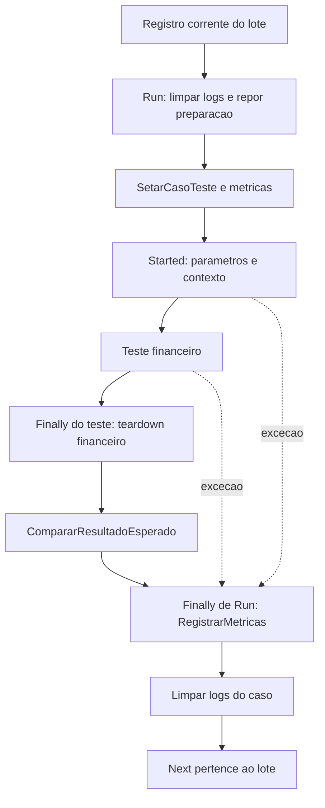

# Fluxo individual

```mermaid
flowchart TD
  Cursor[Registro corrente do lote] --> Run[Run: limpar logs e repor preparacao]
  Run --> Contexto[SetarCasoTeste e metricas]
  Contexto --> Started[Started: parametros e contexto]
  Started --> Teste[Teste financeiro]
  Teste --> Teardown[Finally do teste: teardown financeiro]
  Teardown --> Asserts[CompararResultadoEsperado]
  Asserts --> Finished[Finally de Run: RegistrarMetricas]
  Finished --> Limpeza[Limpar logs do caso]
  Limpeza --> Proximo[Next pertence ao lote]
  Teste -. excecao .-> Finished
  Started -. excecao .-> Finished
```

Falhas preservam o caminho de persistência do finally. Uma falha que impede a continuidade segura pode interromper o lote depois da tentativa de histórico.
