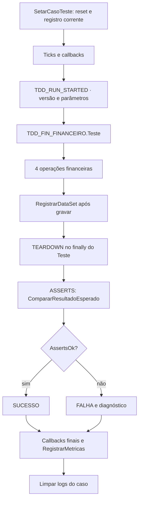

# Fluxo da tentativa financeira

```mermaid
flowchart TD
 C["SetarCasoTeste: reset e registro corrente"] --> T["Ticks e callbacks"]
 T --> S["TDD_RUN_STARTED · versão e parâmetros"]
 S --> F["TDD_FIN_FINANCEIRO.Teste"]
 F --> G["4 operações financeiras"]
 G --> P["RegistrarDataSet após gravar"]
 P --> D["TEARDOWN no finally do Teste"]
 D --> A["ASSERTS: CompararResultadoEsperado"]
 A --> Q{"AssertsOk?"}
 Q -- "sim" --> O["SUCESSO"]
 Q -- "não" --> X["FALHA e diagnóstico"]
 O --> Z["Callbacks finais e RegistrarMetricas"]
 X --> Z
 Z --> L["Limpar logs do caso"]
```
