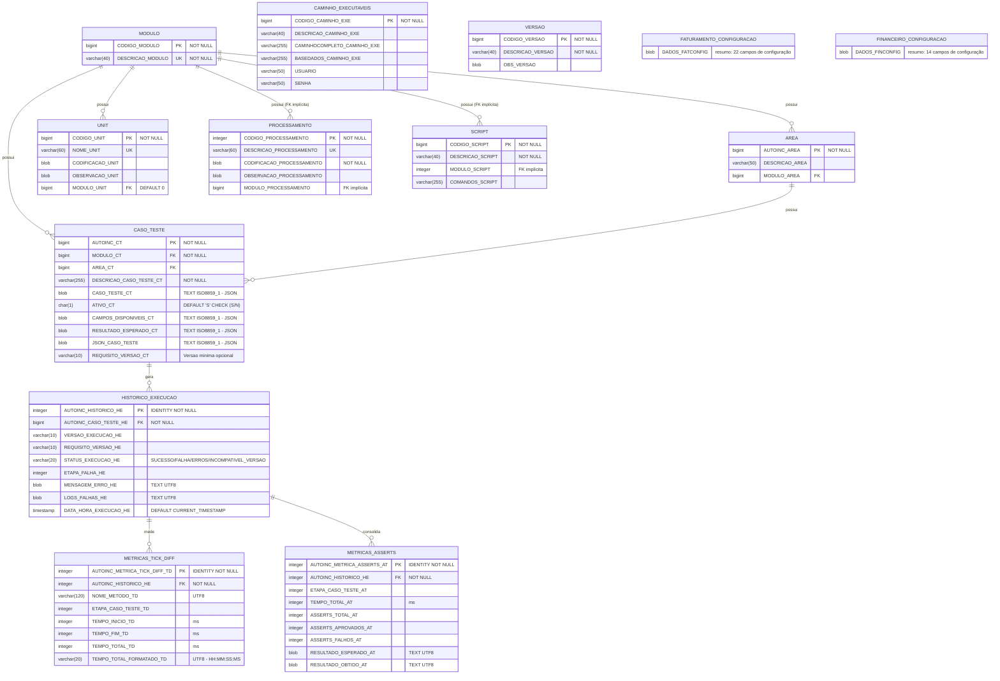

# Modelo Entidade-Relacionamento — TESTEAUTOMATIZADOMC.FDB

Diagrama do banco de dados dedicado de testes automatizados (Firebird 5).

## Diagrama

## Notas

### Blobs de `CASO_TESTE`

Todas as colunas de JSON — `CASO_TESTE_CT`, `CAMPOS_DISPONIVEIS_CT`,
`RESULTADO_ESPERADO_CT` e `JSON_CASO_TESTE` — são **blob texto** (`SUB_TYPE 1`,
`ISO8859_1`).

O Firebird não permite alterar o tipo de uma coluna existente com `ALTER
TABLE`. A conversão foi feita pela técnica das 4 fases: criar a coluna nova no
tipo alvo → `UPDATE` movendo os dados → `DROP` da coluna antiga →
`ALTER COLUMN ... TO` renomeando a nova para o nome original. Por isso a
conversão roda em **duas transações**: a Fase 1 precisa de `COMMIT` para o DML
enxergar a coluna nova, e as Fases 2–4 ficam num único bloco atômico.

Scripts: `sql/migracao_blob_binario_para_texto_caso_teste.sql` (2 primeiras
colunas + criação de `JSON_CASO_TESTE`) e
`sql/temp-local/migracao_blob_binario_para_texto_caso_teste_ct.sql`
(`CASO_TESTE_CT`).

A conversão de `CASO_TESTE_CT` o moveu para a última posição da tabela, já que o
Firebird não permite reordenar colunas. O código não é afetado: usa listas
explícitas de colunas e `FieldByName`.

### Tabelas de métricas do TDD_RUNNER

`HISTORICO_EXECUCAO`, `METRICAS_TICK_DIFF` e `METRICAS_ASSERTS` foram criadas por
`sql/migracao_tdd_runner_metricas.sql`. São gravadas por `P39_TDD_FINISHED.pas`
(`INSERT ... RETURNING AUTOINC_HISTORICO_HE`) e lidas pelo `TDD_RUNNER`.
`STATUS_EXECUCAO_HE` é validado por `CK_HISTORICO_EXECUCAO_STATUS`.

### FKs implícitas

`PROCESSAMENTO.MODULO_PROCESSAMENTO` e `SCRIPT.MODULO_SCRIPT` referenciam
semanticamente `MODULO.CODIGO_MODULO`, mas **não existe constraint FOREIGN KEY
no schema**. O diagrama mantém essas relações destacadas como "FK implícita"
para documentar a intenção.

### Tabelas de configuração sem PK

`FATURAMENTO_CONFIGURACAO` e `FINANCEIRO_CONFIGURACAO` **não possuem chave
primária** de forma proposital: armazenam apenas **um único registro** de
configuração global, sem necessidade de identificação individual.
