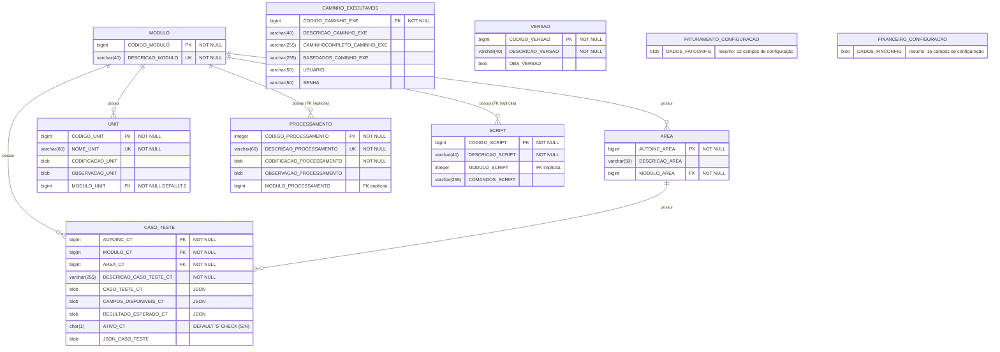

# Modelo Entidade-Relacionamento — TESTEAUTOMATIZADOMC.FDB

Diagrama do banco de dados dedicado de testes automatizados (Firebird 5).

## Diagrama

## Notas

### FKs implícitas

`PROCESSAMENTO.MODULO_PROCESSAMENTO` e `SCRIPT.MODULO_SCRIPT` referenciam
semanticamente `MODULO.CODIGO_MODULO`, mas **não existe constraint FOREIGN KEY
no schema**. O diagrama mantém essas relações destacadas como "FK implícita"
para documentar a intenção.

### Tabelas de configuração sem PK

`FATURAMENTO_CONFIGURACAO` e `FINANCEIRO_CONFIGURACAO` **não possuem chave
primária** de forma proposital: armazenam apenas **um único registro** de
configuração global, sem necessidade de identificação individual.
