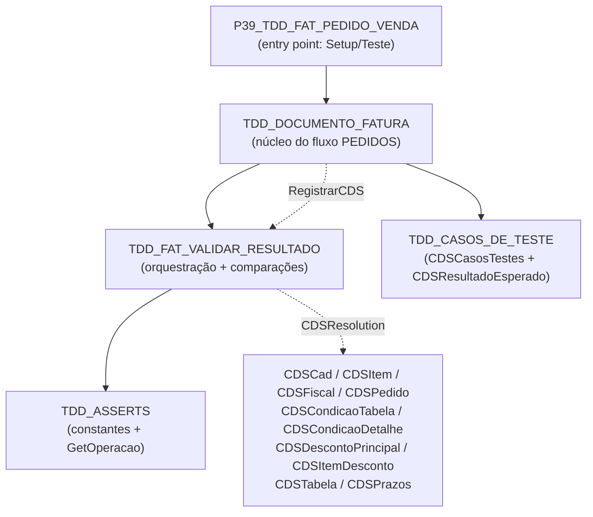
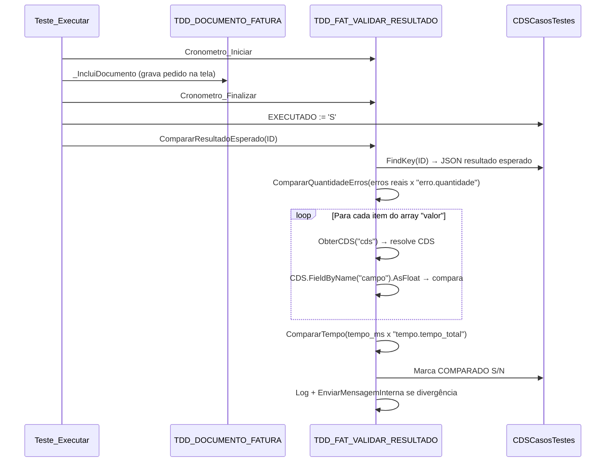

# TDD_FAT_VALIDAR_RESULTADO

Unit de validação do resultado esperado dos casos de teste do fluxo **PEDIDO DE VENDA**
(módulo FATURAMENTO / área PEDIDO DE VENDA). Faz a ponte entre o núcleo
`TDD_DOCUMENTO_FATURA` e os CDSComponents do formulário, executando toda a lógica de
comparação (antes parcialmente no `TDD_ASSERTS`, agora centralizada aqui).

## Mapeamento de uses



## Fluxo de validação



## Formato do JSON de resultado esperado (`RESULTADO_ESPERADO_CT`)

```json
{
  "erro": {"quantidade": 0, "operacao": "Igual"},
  "valor": [
    {"cds": "CDSCad",  "campo": "VALOR_BRUTO_DOCFAT",  "operacao": "Maior", "resultado": 155.015},
    {"cds": "CDSPedido","campo": "TABELA_DOCPED",      "operacao": "Maior", "resultado": 0},
    {"cds": "CDSFiscal","campo": "TIPOFRETE_DOCFISCAL", "operacao": "Igual", "resultado": 9}
  ],
  "tempo": {"tempo_total": 10000, "tipo_registo": "milisegundo"}
}
```

| Seção | Campos | Comportamento |
| --- | --- | --- |
| `erro` | `quantidade`, `operacao` | Compara erros reais (`RegistrarErroReal`) x configurado |
| `valor` | array: `cds`, `campo`, `operacao`, `resultado` | Cada item resolve o CDS pelo nome e compara o campo |
| `tempo` | `tempo_total`, `tipo_registo` | Limite de tempo total da inclusão (ms) |

## CDS mapeados no formulário

| Tag `"cds"` | CDS Component | Responsabilidade |
| --- | --- | --- |
| `CDSCad` | CDSCadastro | Dados principais do documento |
| `CDSItem` | CDSItem | Itens do pedido |
| `CDSFiscal` | CDSFiscal | Dados fiscais / frete |
| `CDSPedido` | CDSPedido | Tabela de preço, condições, prazos |
| `CDSCondicaoTabela` | CDSCondicaoTabela | Condições de pagamento |
| `CDSCondicaoDetalhe` | CDSCondicaoDetalhe | Prazos das condições |
| `CDSDescontoPrincipal` | CDSDescontoPrincipal | Descontos gerais |
| `CDSItemDesconto` | CDSItemDesconto | Descontos por item |
| `CDSTabela` | CDSTabela | Tabela de preços |
| `CDSPrazos` | CDSPrazos | Prazos manuais |

## Observações

- O registro dos CDS é feito uma única vez no `Setup_IniciarFormulario`, após os `FindComponent`,
  evitando chamadas repetidas por caso de teste.
- Se a tag `"cds"` for omitida em um item do array `"valor"`, o CDS padrão é `CDSCad`.
- `Arredondar` é definido localmente para evitar dependência de units externas.
- `GetOperacao` e as constantes `cOperacao*` são herdados do `TDD_ASSERTS` (namespace compartilhado).
