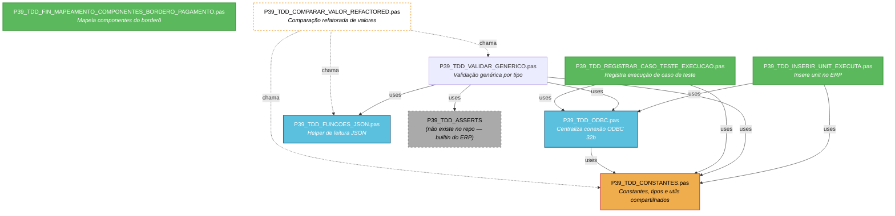
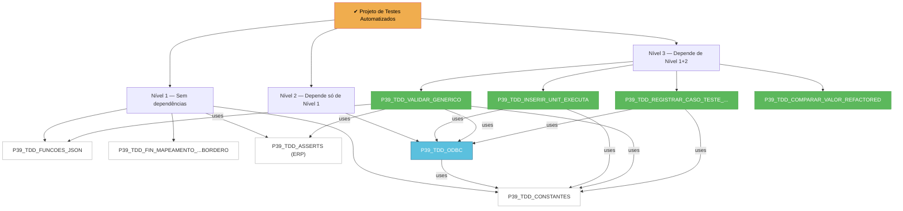

# Diagrama Mermaid — Units do Projeto de Testes Automatizados

## Grafo de Dependências (uses)

## Legenda

| Cor | Significado |
|-----|-------------|
| **Laranja** | **Camada core** — constantes e tipos usados por todas as units |
| **Azul** | **Infraestrutura** — helpers de conexão e parsing |
| **Verde** | **Units de aplicação** — scripts de inserção, registro e mapeamento |
| **Cinza tracejado** | **Unit ausente** — `P39_TDD_ASSERTS` não existe no repo (builtin do ERP) |
| **Branco laranja tracejado** | **Dependência implícita** — chamadas diretas sem `uses` formal |

---

## Árvore hierárquica de dependências

---

**Nota:** A unit `P39_TDD_ASSERTS` é referenciada em `uses` da unit `P39_TDD_VALIDAR_GENERICO` mas não possui arquivo `.pas` neste repositório — é provavelmente um módulo embutido no motor de script do ERP.
